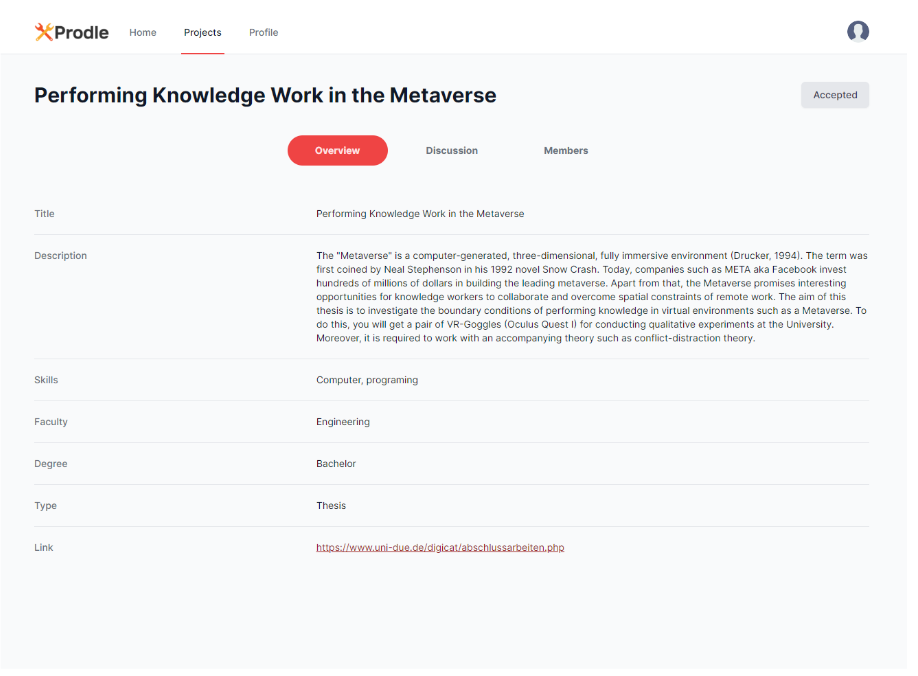
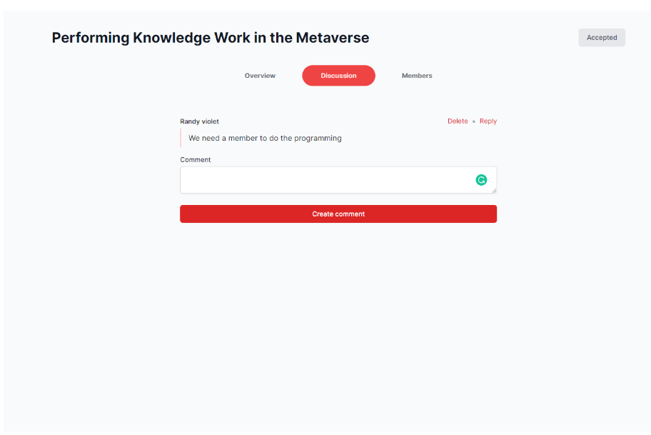
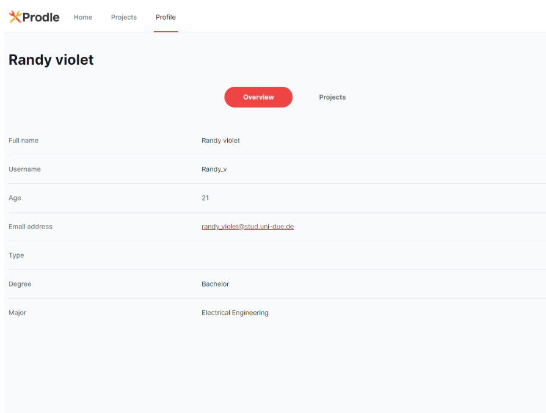

# Prodle
Get those credits, get that degree


## Description

Finding a suitable project for our Bachelor’s /Master’s project and thesis has been a cumbersome process in the past.
With prodles, you are able to find the right project with just a few click. But that's only half of the problems.
Sometimes, we need to find  group members with similar way of working that also needs to do a project which has been hard to find due to pandemics, lack of time to socialize, etc.
Prodles help to connect you with other people who are interested in the same project so you can start your project in no time!

## Features

### Projects
- Add a new project
- Search for a project
- Join/apply to a project
- Delete a project
- Accept/decline a join request



### Discussions
- Create a thread
- Reply to a thread
- Delete a thread



### Users
- Create user profile
- See other user’s profile
- Connecting user with each others
- See user’s past works/projects




## Project Architecture

)

## Libraries / Algorithms Used

### Back end
                
| Technology | Function |
| ------ | ------ |
| MongoDB Atlas | Files are hosted in MongoDB Atlas database |
| NodeJS | Asynchronous JavaScript runtime environment |
| Express |  Connection with the front end is done through API developed in Express|

### Front end

| Technology | Function |
| ------ | ------ |
| React | Used to make a single page application |
| Tailwind CSS | CSS framework to design the user interface |

## Video Demonstration


## How to run the project

You need to have Node.js installed

### Running the Database

- Open your terminal or command prompt
- Change to the ‘/backend’
- Type ‘npm install’
- Type ‘npm run-script dev’

```
cd backend
npm install
npm run-script dev
```

Output:		
```
Listening on 3600.
Connected to database
```

### Running the Frontend
- Open your terminal or command prompt
- Change to the ‘/frontend’
- Type ‘npm install’
- Type ‘npm start’
- Open your browser and go to http://localhost:3600/

```
cd frontend
npm install
npm start
```

## Building

### Building the Frontend

- Go to the frontend directory
- Build the frontend
- Copy all files from “frontend/dist/my-angular-app” into “backend/public”

```
cd frontend
npm run-script build
```

### Building the Backend

- Go to the backend directory
- Build the backend


```
cd ../backend
npm run-script build
```

## Deployment

- Create a new app in Heroku
- Open a terminal and go to the directory of our project
- Create a new Git repository in the folder 
- Add our Heroku project as a git remote

```
git init
heroku git:remote -a <app-name>

```

- Push the new repository into Heroku
- Open  https://<app-name>.herokuapp.com

```
git add . 
git commit -am “Add code”
git push heroku master

```


## Group Members
- Jean Qussa
- Nurmalita Manggali
- Nave Wibowo
